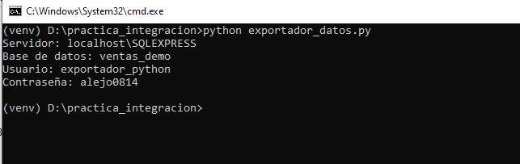
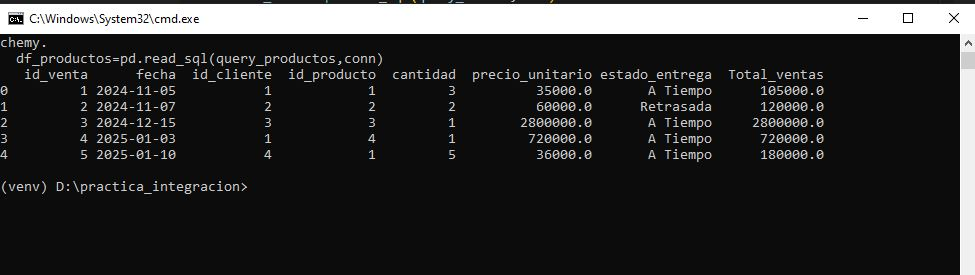
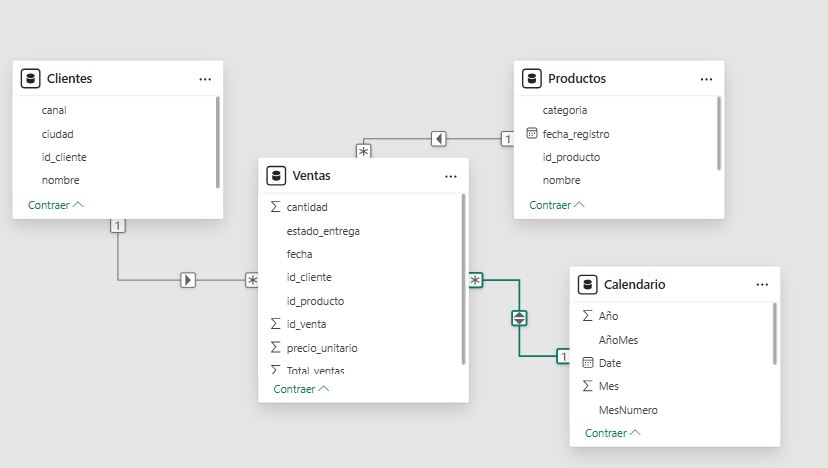
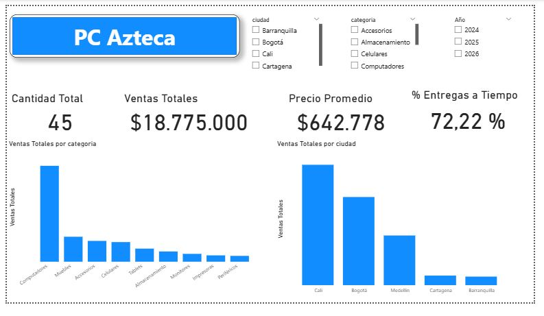
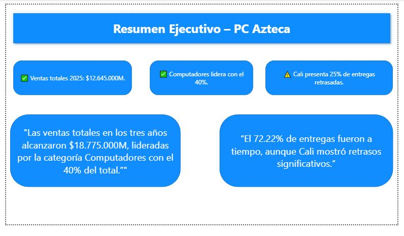

# Proyecto Integrador – SQL + Python + Power BI

## 📌 Resumen Ejecutivo
Este proyecto demuestra un flujo **empresarial real** de análisis de datos:
1. Creación de una base de datos en **SQL Server** (tablas de hechos y dimensiones).
2. Extracción y limpieza de datos con **Python**.
3. Exportación de archivos limpios en **Excel** para integrarlos a Power BI.
4. Construcción de un modelo estrella, medidas DAX y dashboard profesional en **Power BI**.
5. Storytelling con hallazgos clave.

---

## ⚙️ 1. SQL Server

### Creación de Base de Datos y Tablas
```sql
CREATE DATABASE ventas_demo;
GO

USE ventas_demo;

CREATE TABLE clientes(
    id_cliente INT IDENTITY(1,1) PRIMARY KEY,
    nombre NVARCHAR(100),
    ciudad NVARCHAR(50),
    canal NVARCHAR(50)
);

CREATE TABLE productos(
    id_producto INT IDENTITY(1,1) PRIMARY KEY,
    nombre NVARCHAR(100),
    categoria NVARCHAR(50),
    fecha_registro DATE,
    precio_unitario DECIMAL(12,2)
);

CREATE TABLE ventas(
    id_venta INT IDENTITY(1,1) PRIMARY KEY,
    fecha DATE NOT NULL,
    id_cliente INT NOT NULL,
    id_producto INT NOT NULL,
    cantidad INT NOT NULL,
    precio_unitario DECIMAL(12,2) NOT NULL,
    estado_entrega NVARCHAR(20),
    FOREIGN KEY (id_cliente) REFERENCES clientes(id_cliente),
    FOREIGN KEY (id_producto) REFERENCES productos(id_producto)
);
```

### Consultas de Práctica (JOINs)
```sql
-- Ventas totales por ciudad en 2025
SELECT c.ciudad,
       SUM(v.cantidad * v.precio_unitario) AS ventas_totales
FROM ventas v
INNER JOIN clientes c ON v.id_cliente = c.id_cliente
WHERE YEAR(v.fecha) = 2025
GROUP BY c.ciudad;
```

---

## 🐍 2. Python

Scripts principales:

- **conexion_sql.py** → conexión con SQL Server usando `.env`.
- **probar_conexion.py** → validación de credenciales.
- **procesar_datos.py** → flujo principal: diagnóstico (`.info()`, `.isna()`, `.duplicated()`), limpieza y exportación final.

### Ejemplo de Limpieza en Python
```python
# Convertir fecha
df_ventas["fecha"] = pd.to_datetime(df_ventas["fecha"])

# Crear columna calculada
df_ventas["Total_ventas"] = df_ventas["cantidad"] * df_ventas["precio_unitario"]

# Normalizar textos
df_clientes["nombre"] = df_clientes["nombre"].str.strip().str.title()
df_clientes["ciudad"] = df_clientes["ciudad"].str.strip().str.title()
df_clientes["canal"]  = df_clientes["canal"].str.strip().str.title()
```

Los archivos limpios se exportaron a la carpeta `/archivos_limpios`.

---

## 📊 3. Power BI

### Modelo Estrella
- Tabla de hechos: **Ventas**.
- Dimensiones: **Clientes**, **Productos**, **Calendario**.

### Medidas DAX
```DAX
Total Ventas = SUMX(ventas, ventas[cantidad] * ventas[precio_unitario])

Precio Promedio = AVERAGE(ventas[precio_unitario])

% Entregas a Tiempo = 
DIVIDE(
    CALCULATE(COUNTROWS(ventas), ventas[estado_entrega] = "A Tiempo"),
    COUNTROWS(ventas),
    0
)
```

### Visualizaciones
- Cantidad total de ventas.
- Ventas por ciudad y categoría.
- Precio promedio.
- % de entregas a tiempo.
- Storytelling ejecutivo.

---

## 📝 4. Storytelling

> “Las ventas totales en 2025 alcanzaron **$18.775M**, lideradas por la categoría **Computadores** con el 40% del total.  
> El **72.22% de entregas** fueron a tiempo, aunque **Cali presentó un 25% de retrasos**.”

---

## 🛠️ 5. Tips Técnicos

- Crear usuarios en SQL Server:  
  ```sql
  CREATE LOGIN exportador_python WITH PASSWORD = '***';
  USE ventas_demo;
  CREATE USER exportador_python FOR LOGIN exportador_python;
  ALTER ROLE db_datareader ADD MEMBER exportador_python;
  ```
- Uso de `.env` para credenciales seguras en Python.
- Rutas absolutas con `Path(__file__)` para asegurar ejecución desde cualquier carpeta.
- Normalizar texto con `.str.strip().str.title()`.
- Carpeta `/archivos_limpios` centralizada para exportaciones.

---

## 📷 6. Evidencias

### Conexión

### Conexión con .env + pyodbc


### Ejecución en terminal con Python


### Modelo Estrella


### Dashboard Ejecutivo


### Storytelling


---

## 🚀 Conclusión
Este flujo (SQL → Python → Excel limpio → Power BI) permite replicar un **pipeline real de analítica empresarial**, aplicable en cualquier organización.
